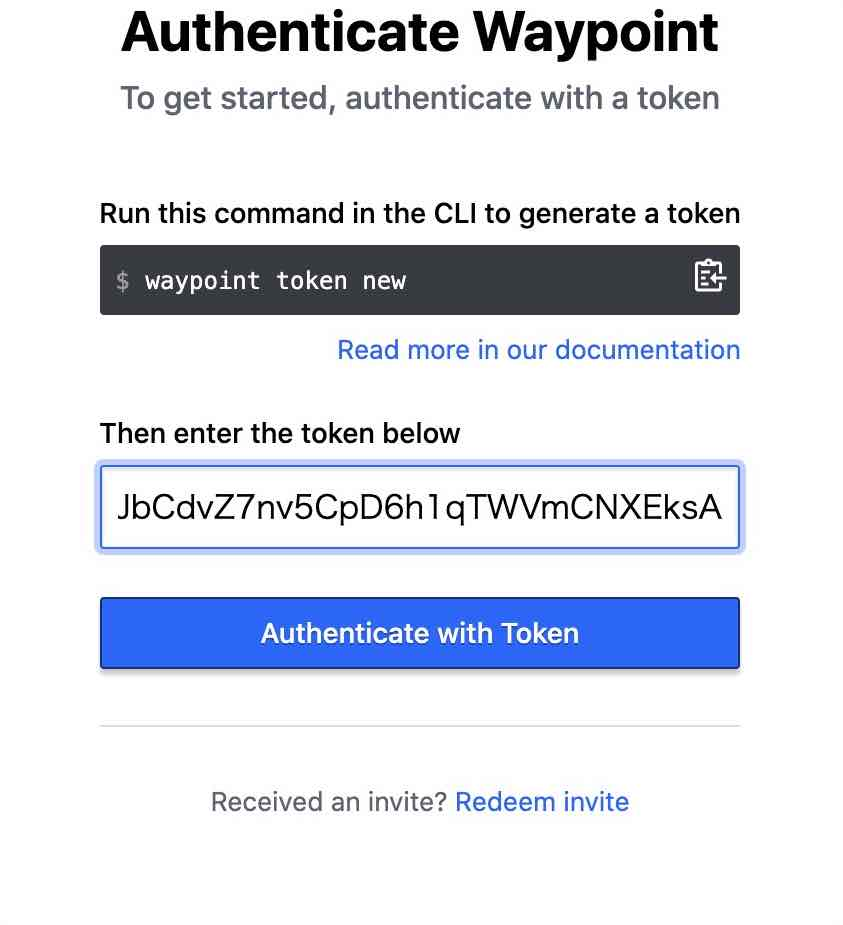
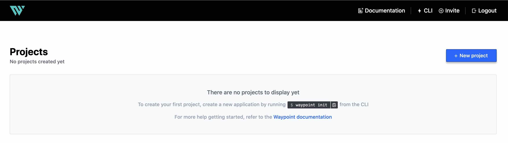
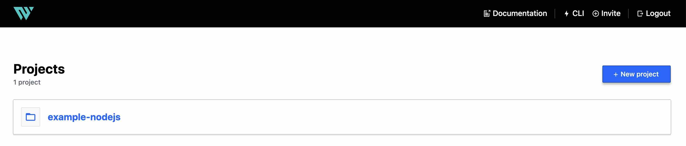
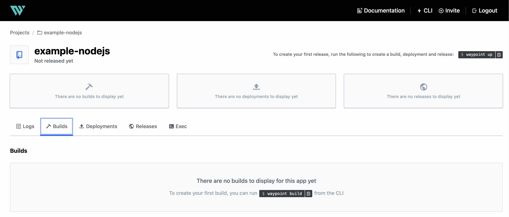
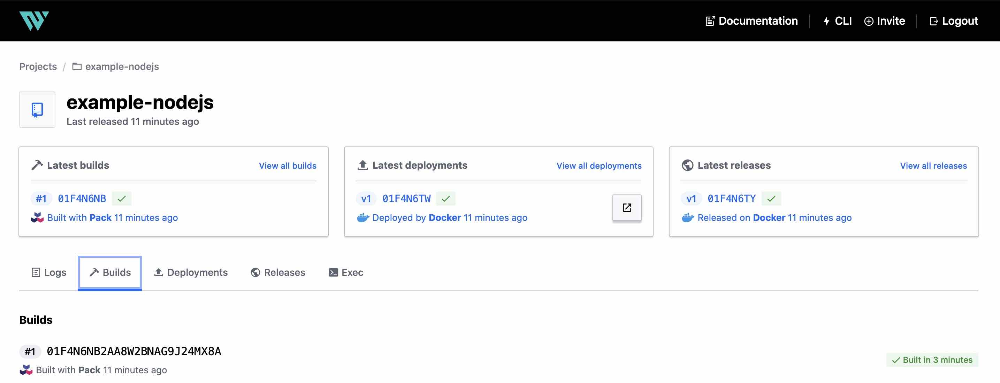
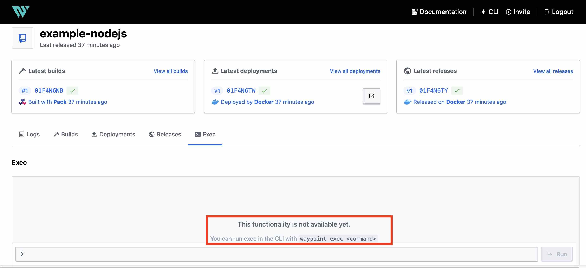

# waypoint-introduction

I tried the first step of waypoint.

## Prerequirement

- Docker Desktop
- brew(for mac)

## Install Waypoint CLI

Install waypoint cli tool.

```bash
$ brew tap hashicorp/tap
$ sudo chown -R $(whoami) /usr/local/lib/pkgconfig
$ chmod u+w /usr/local/lib/pkgconfig
$ brew install hashicorp/tap/waypoint
$ waypoint version
CLI: v0.3.1 (b550e5ce)
```

## Install Waypoint Server Locally

Install waypoint server using docker.

```bash
$ docker pull hashicorp/waypoint:latest
$ waypoint install -platform=docker -accept-tos
```

confirm.

```bash
$ docker images
REPOSITORY                                 TAG                 IMAGE ID            CREATED             SIZE
...
hashicorp/waypoint                         latest              03439ba3c8ec        10 days ago         290MB
...

$ docker ps -a
CONTAINER ID        IMAGE                           COMMAND                  CREATED             STATUS                    PORTS                              NAMES
...
20b5ad61e781        hashicorp/waypoint:latest       "/usr/bin/waypoint r…"   2 minutes ago       Up 2 minutes                                                 waypoint-runner
54254cd2321f        hashicorp/waypoint:latest       "/usr/bin/waypoint s…"   2 minutes ago       Up 2 minutes              0.0.0.0:9701-9702->9701-9702/tcp   waypoint-server
...

$ netstat -an | grep 9701
tcp46      0      0  *.9701                 *.*                    LISTEN     

$ netstat -an | grep 9702
tcp46      0      0  *.9702                 *.*                    LISTEN     
```

```bash
$ docker diff 54254cd2321f
C /home
C /home/waypoint
A /home/waypoint/.config
A /home/waypoint/.config/waypoint
```

```
$ docker inspect 54254cd2321f
...
        "Mounts": [
            {
                "Type": "volume",
                "Name": "waypoint-server",
                "Source": "/var/lib/docker/volumes/waypoint-server/_data",
                "Destination": "/data",
                "Driver": "local",
                "Mode": "z",
                "RW": true,
                "Propagation": ""
            }
        ],
        "Config": {
            "Hostname": "54254cd2321f",
            "Domainname": "",
            "User": "waypoint",
            "AttachStdin": true,
            "AttachStdout": true,
            "AttachStderr": true,
            "ExposedPorts": {
                "9701/tcp": {},
                "9702/tcp": {}
            },
            "Tty": false,
            "OpenStdin": true,
            "StdinOnce": true,
            "Env": [
                "PORT=9701",
                "PATH=/usr/local/sbin:/usr/local/bin:/usr/sbin:/usr/bin:/sbin:/bin",
                "USER=waypoint",
                "HOME=/home/waypoint",
                "XDG_RUNTIME_DIR=/run/user/100"
            ],
            "Cmd": [
                "server",
                "run",
                "-accept-tos",
                "-vvv",
                "-db=/data/data.db",
                "-listen-grpc=0.0.0.0:9701",
                "-listen-http=0.0.0.0:9702"
            ],
            "Image": "hashicorp/waypoint:latest",
            "Volumes": {
                "/data": {}
            },
            "WorkingDir": "",
            "Entrypoint": [
                "/usr/bin/waypoint"
            ],
            "OnBuild": null,
            "Labels": {
                "waypoint-type": "server"
            }
        },
...
```


## Access Local Server

Access own your browser.

https://localhost:9702


Click Autenticate.


Execute following command. and copy token string.

```bash
$ waypoint token new
bM152PWkXxfoy4vA51JFhR7LpcXSqtvXHGHaHnapPx1VY86HXJK7vG9ytXiDaHhffD5CAi3amJbCdvZ7nv5CpD6h1qTWVmCNXEksA
```

Paste token string and Authencated with Token Button.




Logged in.




## First Project Deploy

### Deploy Example Node.js Application on Docker

Download the example source codes.

```bash
$ git clone https://github.com/hashicorp/waypoint-examples.git
$ ls docker
angular		go		next-js		php		reactjs		static
aspnetapp	java		nodejs		python		ruby		svelte
$ cd docker/nodejs
```

Confirm waypoint.hcl file and initialize.

```bash
$ cat waypoint.hcl 
project = "example-nodejs"

app "example-nodejs" {
  labels = {
    "service" = "example-nodejs",
    "env"     = "dev"
  }

  build {
    use "pack" {}
  }

  deploy {
    use "docker" {}
  }
}

$ waypoint init
✓ Configuration file appears valid
✓ Connection to Waypoint server was successful
✓ Project "example-nodejs" and all apps are registered with the server.
✓ Plugins loaded and configured successfully

Project initialized!

You may now call 'waypoint up' to deploy your project or
commands such as 'waypoint build' to perform steps individually.
```

Registered example project on waypoint UI.



Nothing is displayed in the Build, Depoly, Release.



Deploy example application on Docker.

```bash
$ waypoint up

» Building...
Creating new buildpack-based image using builder: heroku/buildpacks:18
✓ Creating pack client
✓ Building image
 │ [exporter] Adding layer 'launcher'
 │ [exporter] Adding layer 'config'
 │ [exporter] Adding label 'io.buildpacks.lifecycle.metadata'
 │ [exporter] Adding label 'io.buildpacks.build.metadata'
 │ [exporter] Adding label 'io.buildpacks.project.metadata'
 │ [exporter] Saving index.docker.io/library/example-nodejs:latest...
 │ [exporter] *** Images (1cabe60212cc):
 │ [exporter]       index.docker.io/library/example-nodejs:latest
 │ [exporter] Adding cache layer 'heroku/nodejs-engine:nodejs'
 │ [exporter] Adding cache layer 'heroku/nodejs-engine:toolbox'
✓ Injecting entrypoint binary to image

Generated new Docker image: example-nodejs:latest

» Deploying...
✓ Setting up waypoint network
✓ Starting container
✓ App deployed as container: example-nodejs-01F4N6TXCQT69GPA0ZV6G1JRQB

» Releasing...

The deploy was successful! A Waypoint deployment URL is shown below. This
can be used internally to check your deployment and is not meant for external
traffic. You can manage this hostname using "waypoint hostname."

           URL: https://mutually-genuine-mutt.waypoint.run
Deployment URL: https://mutually-genuine-mutt--v1.waypoint.run
```

### Confirm Waypoint UI

See the following URL in your browser, confirm deplyed example application.

https://mutually-genuine-mutt--v1.waypoint.run


Waypoint UI.

https://localhost:9702


Confirm build, deployed, released.



### Confirm Docker

execute docker command.

```bash
$ docker ps -a
CONTAINER ID        IMAGE                           COMMAND                  CREATED             STATUS                    PORTS                              NAMES
622e7ad5b2c9        example-nodejs:latest           "/waypoint-entrypoin…"   16 minutes ago      Up 16 minutes             0.0.0.0:32768->3000/tcp            example-nodejs-01F4N6TXCQT69GPA0ZV6G1JRQB
```

### waypoint exec

waypoint ui 0.3.1 does not yet implement waypoint exec.



execute waypoint cli waypoint exec.

```bash
$ waypoint exec -app=example-nodejs /bin/sh
Connected to deployment v1
$ ls
app  boot  dev	home   layers  lib64  mnt  proc  run   srv  tmp  var		      workspace
bin  cnb   etc	input  lib     media  opt  root  sbin  sys  usr  waypoint-entrypoint
$ cd workspace
$ ls
Procfile  README.md  index.js  node_modules  package.json  public  views  waypoint.hcl
$ exit
```

### waypoint log

```bash
$ waypoint logs
2021-05-02T00:14:47.748Z E4N98S: [INFO]  entrypoint: entrypoint starting:
deployment_id=01F4N6TWSBNH33FES64SMRAR8E instance_id=01F4N6TXWSHVF0BTWE3FE4N98S args=[/cnb/lifecycle/launcher]
2021-05-02T00:14:47.748Z E4N98S: [INFO]  entrypoint: entrypoint version: full_string=v0.3.1 version=v0.3.1
prerelease= metadata= revision=
2021-05-02T00:14:47.748Z E4N98S: [INFO]  entrypoint: server version info: version=v0.3.1 api_min=1
api_current=1 entrypoint_min=1 entrypoint_current=1
2021-05-02T00:14:48.449Z E4N98S: [INFO]  entrypoint.config.watcher: env vars changed, sending new child command
2021-05-02T00:14:48.450Z E4N98S: [INFO]  entrypoint.child: starting child process:
args=[/cnb/lifecycle/launcher] cmd=/cnb/lifecycle/launcher
2021-05-02T00:14:48.750Z E4N98S: Listening on 3000
2021-05-02T00:44:42.817Z E4N98S: [INFO]  entrypoint.exec: starting exec stream: index=1 args=[/bin/sh]
2021-05-02T00:44:42.818Z E4N98S: [INFO]  entrypoint.exec: pty requested, allocating a pty: index=1
2021-05-02T00:45:31.267Z E4N98S: [INFO]  entrypoint.exec: exec stream exited: index=1 code=127
2021-05-02T00:45:31.271Z E4N98S: [INFO]  entrypoint.exec: exec stream ended by client: index=1
2021-05-02T00:45:59.887Z E4N98S: [INFO]  entrypoint.exec: starting exec stream: index=2 args=[/bin/sh]
2021-05-02T00:45:59.887Z E4N98S: [INFO]  entrypoint.exec: pty requested, allocating a pty: index=2
2021-05-02T00:51:07.176Z E4N98S: [INFO]  entrypoint.exec: exec stream exited: index=2 code=0
2021-05-02T00:51:07.180Z E4N98S: [INFO]  entrypoint.exec: exec stream ended by client: index=2
```

## Other Commands.

```bash
$ waypoint project list 
example-nodejs

$ waypoint hostname list
        HOSTNAME        |                FQDN                |
LABELS                                                                 
------------------------+------------------------------------+----------------------------------------------------------
  mutually-genuine-mutt | mutually-genuine-mutt.waypoint.run | map[waypoint.hashicorp.com/app:example-nodejswaypoint.hashicorp.com/project:example-nodejs waypoint.hashicorp.com/workspace:default]  

$ waypoint artifact list
    | ID | REGISTRY | DETAILS |    STARTED     |   COMPLETED     
----+----+----------+---------+----------------+-----------------
  ✔ |  1 | pack     | build:1 | 23 minutes ago | 23 minutes ago  
```

## Reference

https://learn.hashicorp.com/tutorials/waypoint/get-started-install

https://www.waypointproject.io/commands

